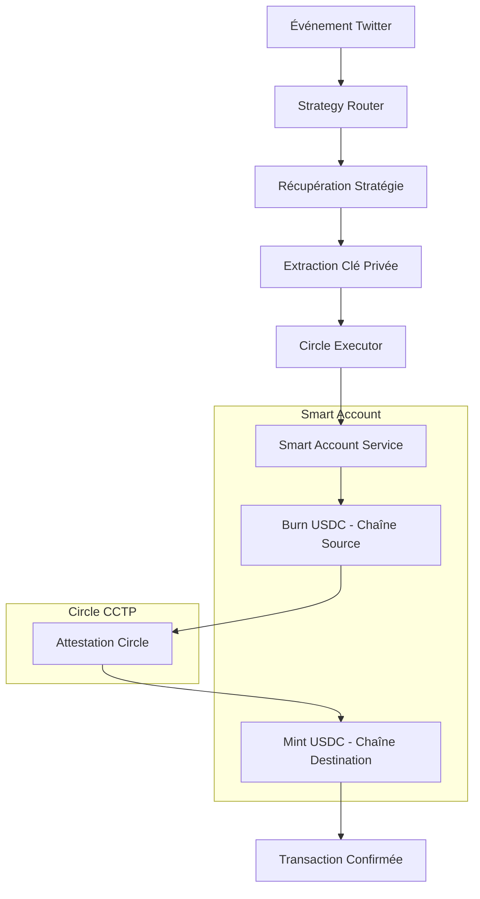

# 🌉 Bridge Gasless CCTP dans triggVest

## 🎯 Objectif

Cette intégration permet à triggVest d'exécuter des bridges cross-chain **gasless** en utilisant Circle CCTP et Circle Paymaster. Les stratégies peuvent maintenant déclencher des transferts USDC entre différentes chaînes sans que l'utilisateur ait besoin de tokens natifs pour payer les frais de gas.

## ✨ Fonctionnalités

### 🔥 Bridge Gasless CCTP
- **Burn & Mint** : Utilise le protocole CCTP de Circle pour des transferts natifs USDC
- **Transactions gasless** : Utilise Circle Paymaster pour payer les frais en USDC
- **Smart Accounts** : Chaque stratégie dispose d'un Smart Account géré automatiquement
- **Attestations Circle** : Récupération automatique des attestations pour finaliser les transferts

### 🌐 Chaînes Supportées
- **Arbitrum Sepolia** (421614) ⚡ Gasless
- **Base Sepolia** (84532) ⚡ Gasless  
- **Ethereum Sepolia** (11155111)
- **Avalanche Fuji** (43113)
- **Optimism Sepolia** (11155420)
- **Polygon Amoy** (80002)

*⚡ = Support des transactions gasless avec Circle Paymaster*

## 🏗️ Architecture



## 🔧 Installation & Configuration

### 1. Dépendances
```bash
cd triggVest
npm install viem @circle-fin/modular-wallets-core
```

### 2. Variables d'environnement
Ajoutez ces variables à votre `.env` :

```bash
# Circle Paymaster
CIRCLE_PAYMASTER_V08_ADDRESS="0x31BE08D380A21fc740883c0BC434FcFc88740b58"

# Bundlers Pimlico
BUNDLER_URL_ARB_SEPOLIA="https://api.pimlico.io/v2/421614/rpc?apikey=YOUR_API_KEY"
BUNDLER_URL_BASE_SEPOLIA="https://api.pimlico.io/v2/84532/rpc?apikey=YOUR_API_KEY"
PIMLICO_API_KEY="YOUR_PIMLICO_API_KEY"
```

### 3. Base de données
Le schéma Prisma est déjà configuré. Exécutez :

```bash
npx prisma generate
npx prisma db push
```

## 🚀 Utilisation

### 1. Créer une stratégie avec bridge gasless

```javascript
const strategy = {
  userWalletAddress: "0x742d35Cc6644C30532e6391A35e7c785d0E7a123",
  strategyName: "Bridge Gasless Strategy",
  triggers: [
    {
      type: "twitter",
      account: "@realdonaldtrump",
      keywords: ["recession", "economy"]
    }
  ],
  actions: [
    {
      type: "bridge_gasless",
      targetAsset: "USDC",
      targetChain: "Base",
      sourceChain: "Arbitrum",
      amount: "100"
    }
  ]
};
```

### 2. Démarrer les services

```bash
# Terminal 1 - Strategy Router
cd apps/strategy-router-api
npm run dev

# Terminal 2 - Circle Executor  
cd apps/circle-executor-api
npm run dev

# Terminal 3 - Test d'intégration
npm run test:gasless-bridge
```

### 3. Tester l'intégration

```bash
# Test complet du bridge gasless
node scripts/test-gasless-bridge.js

# Test spécifique des alertes de solde insuffisant
node scripts/test-insufficient-balance.js

# Aide pour les scripts
node scripts/test-gasless-bridge.js --help
node scripts/test-insufficient-balance.js --help
```

## 📋 Processus de Bridge Gasless

### Étape 1: Trigger
1. Un événement Twitter matche avec une stratégie
2. Le Strategy Router récupère la stratégie et sa clé privée
3. Le job est envoyé au Circle Executor avec la clé privée

### Étape 2: Initialisation Smart Account
1. Création du Smart Account Service avec la clé privée
2. Configuration du bundler et du paymaster
3. Vérification du solde USDC

### Étape 3: Burn USDC
1. Appel à `depositForBurn` sur le TokenMessenger
2. Transaction gasless via Circle Paymaster
3. Récupération du hash de transaction

### Étape 4: Attestation
1. Attente de la finalité sur la chaîne source
2. Récupération de l'attestation via l'API Circle
3. Validation de l'attestation

### Étape 5: Mint USDC
1. Création du Smart Account sur la chaîne destination
2. Appel à `receiveMessage` sur le MessageTransmitter
3. Mint des USDC sur la chaîne destination

## 🔍 Logs et Monitoring

### Logs du Circle Executor

#### Bridge réussi
```bash
🔄 Exécution de l'action: bridge_gasless pour user_123
🌉 Initialisation du bridge gasless: 100 USDC de Arbitrum vers Base
✅ Pré-vérification réussie: 150.5 USDC disponible
✅ Source Smart Account created: 0x1234...
💰 Vérification du solde USDC...
💰 Smart Account balance: 150.5 USDC
✅ Solde suffisant pour le bridge gasless
   - Montant à transférer: 100 USDC
   - Solde restant après transaction: 50.5 USDC
🔥 Burn transaction sent: 0xabc123...
✅ Burn transaction confirmed: 0xdef456...
✅ Attestation retrieved
✅ Destination Smart Account created: 0x5678...
🪙 Mint transaction sent: 0x789abc...
✅ Mint transaction confirmed: 0x012def...
✅ Bridge gasless terminé: 100 USDC → Base
```

#### Alerte de solde insuffisant
```bash
🔄 Exécution de l'action: bridge_gasless pour user_456
🌉 Initialisation du bridge gasless: 1000 USDC de Arbitrum vers Base
🚨 ÉCHEC PRÉ-VÉRIFICATION: Solde insuffisant
   - Smart Account: 0x9876...
   - Solde: 50.0 USDC
   - Requis: 1001.0 USDC
   - Manque: 951.0 USDC
❌ Erreur: Solde USDC insuffisant sur Arbitrum: 50.0 USDC disponible, 1001.0 USDC requis. Manque 951.0 USDC.
```

### Vérification des transactions
```bash
# Vérifier l'historique des exécutions
curl http://localhost:3003/api/executions

# Vérifier le statut des APIs
curl http://localhost:3002/api/status
curl http://localhost:3003/api/status
```

## 🛠️ Débogage

## 🚨 Système d'Alertes de Solde

Le système intègre désormais des **alertes intelligentes** pour détecter et prévenir les tentatives de bridge avec des soldes USDC insuffisants.

### 🔍 Vérifications automatiques

1. **Pré-vérification** : Contrôle du solde avant d'initier le processus
2. **Vérification détaillée** : Analyse du solde avec marge pour les frais gasless
3. **Messages informatifs** : Détails précis sur le manque de fonds

### 📊 Informations fournies

- **Solde actuel** du Smart Account
- **Montant requis** pour la transaction
- **Montant recommandé** (incluant frais gasless ~1 USDC)
- **Manque exact** en USDC
- **Adresse du Smart Account** pour les transferts
- **Lien vers le faucet Circle**

### 🧪 Test des alertes

```bash
# Script de test spécifique pour les alertes de solde
node scripts/test-insufficient-balance.js

# Ce script teste intentionnellement avec 999,999 USDC 
# pour déclencher l'alerte de solde insuffisant
```

## 🛠️ Débogage

### Erreurs communes

#### "Smart Account not initialized"
```bash
Solution: Vérifier que Circle Paymaster est configuré
- Chaîne supportée (Arbitrum/Base Sepolia)
- Bundler URL correct
- Paymaster address correct
```

#### "Solde USDC insuffisant"
```bash
🚨 NOUVELLE ALERTE DÉTAILLÉE:
- Solde actuel: X.XX USDC
- Montant requis: Y.YY USDC  
- Montant recommandé: Z.ZZ USDC (incluant frais)
- Manque: W.WW USDC
- Smart Account: 0x1234...
- Solution: Transférer des USDC vers ce Smart Account
- Faucet Circle: https://faucet.circle.com
```

#### "Attestation timeout"
```bash
Solution: Attendre plus longtemps ou vérifier
- Transaction confirmée sur la chaîne source
- API Circle accessible
- Hash de transaction correct
```

#### "Gasless not supported"
```bash
Solution: Utiliser des chaînes supportées
- Source: Arbitrum Sepolia ou Base Sepolia
- Destination: Arbitrum Sepolia ou Base Sepolia
```

## 🔗 Intégration avec cctp-v2-web-app

Le système utilise le même Smart Account Service que cctp-v2-web-app :

```typescript
import { 
  SmartAccountService, 
  createSmartAccountService, 
  isGaslessSupported 
} from './lib/smart-account-service';

// Créer un service pour une stratégie
const smartAccount = await createSmartAccountService(
  strategyPrivateKey,
  SupportedChainId.ARB_SEPOLIA
);

// Exécuter un bridge gasless
const burnTxHash = await smartAccount.burnUSDC(
  parseUnits("100", 6),
  SupportedChainId.BASE_SEPOLIA,
  destinationAddress,
  "fast"
);
```

## 🎯 Prochaines étapes

1. **Tests en environnement mainnet** : Adapter pour les chaînes principales
2. **Monitoring avancé** : Intégration avec des outils de monitoring
3. **Gestion des erreurs** : Système de retry et de notification
4. **Optimisation des frais** : Logique de sélection de chaîne optimale
5. **Interface utilisateur** : Dashboard pour suivre les bridges

## 🔧 Développement

### Structure des fichiers
```
triggVest/
├── lib/
│   └── smart-account-service.ts     # Service Smart Account partagé
├── apps/
│   ├── strategy-router-api/
│   │   └── src/
│   │       ├── index.ts            # Routing et matching
│   │       ├── types.ts            # Types mis à jour
│   │       └── wallet-manager.ts   # Gestion des wallets
│   └── circle-executor-api/
│       └── src/
│           ├── index.ts            # Exécution des bridges
│           └── types.ts            # Types d'actions
└── scripts/
    └── test-gasless-bridge.js      # Script de test
```

### Ajout de nouvelles chaînes
1. Ajouter la chaîne dans `SupportedChainId`
2. Configurer les adresses CCTP dans `smart-account-service.ts`
3. Ajouter le bundler URL dans `.env`
4. Tester avec le script de test

---

**🚀 L'intégration du bridge gasless CCTP est maintenant complète et prête pour les tests !** 