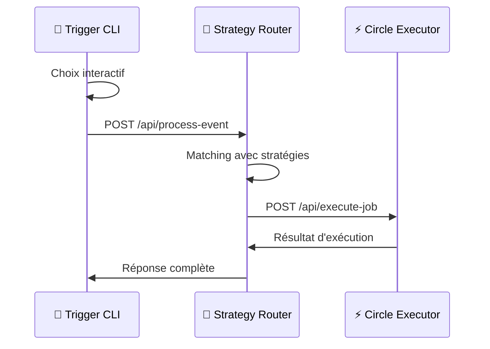

# 🎯 Trigger CLI

CLI interactif pour simuler des événements externes et déclencher les stratégies TriggVest.

## 🚀 Fonctionnalités

- **Interface interactive** : Choix guidé des sources, comptes et contenus
- **Comptes prédéfinis** : Trump, Fed, Elon Musk, Coinbase, Vitalik
- **Contenus suggérés** : Messages types pour chaque compte
- **Validation temps réel** : Vérification des inputs et confirmation
- **Intégration directe** : Envoi HTTP vers Strategy Router API

## 🛠️ Installation & Utilisation

```bash
# Installer les dépendances
npm install

# Démarrer le CLI (mode développement)
npm run cli

# Ou directement
npm run dev
```

## 🎮 Interface CLI

### 1. Choix de la source
```
? Choisissez une source d'événement :
  🐦 Twitter
```

### 2. Sélection du compte
```
? Choisissez un compte Twitter :
  🇺🇸 Donald Trump (@realdonaldtrump)
  🏦 Federal Reserve (@federalreserve)
  🚀 Elon Musk (@elonmusk)
  💰 Coinbase (@coinbase)
  ⚡ Vitalik Buterin (@vitalikbuterin)
  📝 Personnalisé
```

### 3. Contenu du message
```
? Choisissez le contenu du tweet :
  📝 The economy is in terrible shape, massive recession coming!
  📝 Bitcoin to the moon! Great investment!
  📝 Market crash imminent, get out now!
  ✏️  Contenu personnalisé
```

### 4. Confirmation et envoi
```
📋 Résumé de l'événement :
   Source: twitter
   Compte: @federalreserve
   Contenu: "Market outlook showing recession indicators"

? Confirmer l'envoi de cet événement ? (Y/n)
```

## 📨 Flux de données



## 🎯 Exemple d'usage

```bash
$ npm run cli

🎯 Trigger CLI - TriggVest
Simulateur d'événements pour déclencher les stratégies

✅ Strategy Router détecté

? Choisissez une source d'événement : 🐦 Twitter
? Choisissez un compte Twitter : 🏦 Federal Reserve (@federalreserve)
? Choisissez le contenu du tweet : 📝 Market outlook showing recession indicators

📋 Résumé de l'événement :
   Source: twitter
   Compte: @federalreserve
   Contenu: "Market outlook showing recession indicators"

? Confirmer l'envoi de cet événement ? Yes

📤 Envoi de l'événement au Strategy Router...
✅ Événement envoyé avec succès !
📊 Réponse: {
  "success": true,
  "matchedStrategies": 1,
  "strategies": [
    {
      "id": "strategy-1",
      "name": "FED Panic",
      "userId": "user-alice"
    }
  ]
}

🎉 Événement traité avec succès !
? Voulez-vous envoyer un autre événement ? (Y/n)
```

## 📋 Comptes et contenus prédéfinis

### 🇺🇸 Donald Trump (@realdonaldtrump)
- The economy is in terrible shape, massive recession coming!
- Bitcoin to the moon! Great investment!
- Market crash imminent, get out now!
- America First policies will save the economy

### 🏦 Federal Reserve (@federalreserve)
- Interest rates rising due to economic instability
- Market outlook showing recession indicators
- Financial dumping patterns emerging across markets
- Emergency monetary policy measures under consideration

### 🚀 Elon Musk (@elonmusk)
- Bitcoin to the moon! 🚀
- Dogecoin is the future of currency
- Tesla stock going parabolic
- Mars colonization will boost crypto adoption

### 💰 Coinbase (@coinbase)
- New DeFi protocols launching this week
- Crypto adoption reaching all-time highs
- Institutional investors flooding the market
- Revolutionary blockchain technology emerging

### ⚡ Vitalik Buterin (@vitalikbuterin)
- Ethereum 2.0 staking rewards increasing
- Layer 2 solutions scaling exponentially
- DeFi ecosystem reaching maturity
- Smart contract innovation accelerating

## 🔧 Configuration

Le CLI se connecte automatiquement au Strategy Router sur `http://localhost:3002`.

Pour modifier l'URL, éditez la constante `STRATEGY_ROUTER_API` dans `src/index.ts`.

## 🚀 Prérequis

- Strategy Router API démarrée sur le port 3002
- Circle Executor API démarrée sur le port 3003 (pour l'exécution complète)

```bash
# Terminal 1 - Strategy Router
cd ../strategy-router-api && npm run dev

# Terminal 2 - Circle Executor  
cd ../circle-executor-api && npm run dev

# Terminal 3 - Trigger CLI
npm run cli
``` 